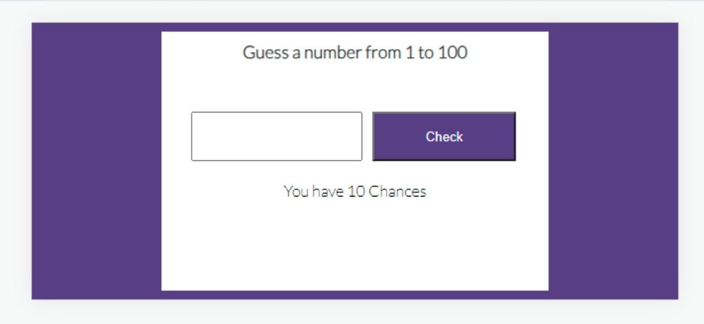

# Guess The Number

Guess the number game is design with kids in mind and it's primary purpose is to help kids to learn numbers and think about numbers approximations and various combinations.

In addition Guess the number game is a site that hopes to demonstrate how pure JavaScript works in a real-world context. The site will be targeted toward people who not only love to implement more advanced JavaScript concepts but also maths. the site is a fully responsive JavaScript game that will allow users to guess number randomly.

## Features

### Existing Features

- __Guess the number Heading__

- Featured at the top of the page, Guess The Number heading is easy to see for the users. Upon viewing the page, the user will be able to see the name and image of the game and understand how to play it.

### As a **first time user**

- I want to be able to access the website from any device.
- I want to easily understand how to play the game.

### As a **returning user**

- I want to be able to play the game again.

- __The Game Area__

- The game have a message that tells the user what to do which is (Guess a number 1 t0 100).
- The user will be able to guess any number starting from 1 to 100. 
- The user will play the game by writing any number and click Check to determine if the guess is correct or wrong. 
- The user will have 10 chances to get the correct number or lose the game.
- At the end of the game, the user can replay as long as the user wants

- __The Score Area__

- This section will allow user to see how many guess they have left in the range of 10 to 1

### Features Left to Implement

- The feature idea is to get the game review the correct number if the user couln't get the correct answer at the guess of 10 to 1.

## Testing

### Validator Testing

- HTML
- No errors were returned when passing through the official [W3C validator](https://validator.w3.org/nu/#textarea)
- CSS
- No errors were found when passing through the official [(Jigsaw) validator](https://jigsaw.w3.org/css-validator/validator)
- Lighthouse
- I used devtools to run it through lighthouse to test the accessibility, Perfomance and SEO 
 
- JavaScript
- No errors were found however, 11 warning when passing through the official [Jshint validator](https://jshint.com/)

## Deployment

- The site was deployed to GitHub pages. The steps to deploy are as follows:
- In the GitHub repository, navigate to the Settings tab
- From the source section drop-down menu, select the Master Branch
- Once the master branch has been selected, the page will be automatically refreshed with a detailed ribbon display to indicate the successful deployment.

The live link can be found here - <https://ngozi89.github.io/Guess-the-number//>

## Credits
- <https://www.codingnepalweb.com/>